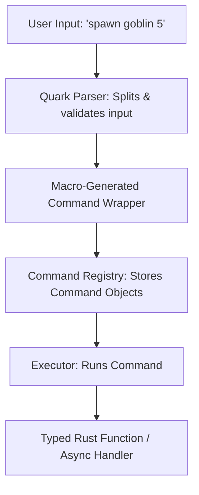

# **Quark**

**Tiny commands, massive impact — fully type-safe and macro-powered for Pulsar.**

Quark is a **high-performance, type-safe command system** for the **Pulsar game engine**. It allows developers to register and execute commands with **compile-time argument checking**, rich documentation, and **async support**, all powered by **ergonomic Rust macros**.

---

## **Features**

* ⚡ **Type-Safe Arguments** — Commands define their argument types at compile time.
* ✨ **Macro-Powered Registration** — Register commands in one line, with zero boilerplate.
* 📚 **Integrated Documentation** — Short descriptions and detailed docs for every command.
* 🔄 **Async & Sync Support** — Works with both synchronous and asynchronous functions.
* 🛠 **Engine-Agnostic** — Can be used anywhere in Pulsar: scripts, core modules, debug consoles.
* 🧩 **Composable & Modular** — Commands can be organized per module, globally queryable.

---

## **Installation**

Add Quark to your Pulsar project:

```toml
# Cargo.toml
[dependencies]
quark = { path = "../quark" } # Replace with GitHub URL when published
```

---

## **Getting Started**

Quark uses a **macro-first approach** to define commands, ensuring **type safety** and **automatic registration**.

```rust
use quark::{Quark, command};

#[command(
    name = "spawn",
    syntax = "spawn <entity> <count>",
    short = "Spawn entities into the game world",
    docs = "Example: `spawn goblin 5` spawns 5 goblins at the current location"
)]
fn spawn(entity: String, count: usize) {
    for _ in 0..count {
        println!("Spawning {}", entity);
    }
}

#[command(
    name = "teleport",
    syntax = "teleport <x> <y> <z>",
    short = "Teleport the player",
    docs = "Example: `teleport 10 20 5` moves the player to coordinates (10, 20, 5)"
)]
async fn teleport(x: f32, y: f32, z: f32) {
    println!("Teleporting player to ({}, {}, {})", x, y, z);
}

fn main() {
    let mut registry = Quark::new();

    // Register macro-annotated commands
    registry.register_command(spawn);
    registry.register_command(teleport);

    // Execute commands safely
    registry.run("spawn goblin 3").unwrap();
    pollster::block_on(registry.run("teleport 10 20 5")).unwrap();
}
```

---

## **Why This Design Works**

1. **Compile-Time Type Safety**
   The macro infers the function argument types and generates a wrapper implementing a `Command` trait. Runtime execution converts the string input into the **exact types** required.

2. **Async & Sync Support**
   Macros detect `async fn` commands and generate the appropriate runtime wrapper.

3. **Rich Documentation**
   Each command has both a short description (`short`) and detailed usage docs (`docs`). This is stored in the registry for CLI autocomplete, debugging, or in-game help menus.

4. **Minimal Boilerplate**
   You define your command as a normal Rust function. The macro handles parsing, registration, and documentation automatically.

---

## **Command Registry API**

| Function                | Description                                                                    |
| ----------------------- | ------------------------------------------------------------------------------ |
| `register_command(cmd)` | Registers a macro-annotated function as a command.                             |
| `run(input)`            | Executes a command string, safely converting arguments to their defined types. |
| `list()`                | Returns all registered commands with their names and descriptions.             |
| `get_docs(name)`        | Returns detailed documentation for a specific command.                         |

---

## **Listing Commands Example**

```rust
for cmd in registry.list() {
    println!("{}: {}", cmd.name(), cmd.short());
    println!("Docs: {}", cmd.docs());
}
```

**Sample Output:**

```
spawn: Spawn entities into the game world
Docs: Example: `spawn goblin 5` spawns 5 goblins at the current location
teleport: Teleport the player
Docs: Example: `teleport 10 20 5` moves the player to coordinates (10, 20, 5)
```

---

## **Advanced Features**

* **Optional Arguments**: Use `Option<T>` in your function signature for optional parameters.
* **Default Values**: The macro can fill in defaults if arguments are missing.
* **Named / Keyword Arguments**: `spawn entity=goblin count=5` style support.
* **Middleware Hooks**: Add logging, permission checks, or analytics before/after command execution.
* **Auto-Completion**: Use type info for dynamic CLI or in-game console suggestions.

---

## **Architecture Overview**



* **MacroWrapper**: Ensures type-safe argument parsing.
* **Registry**: Stores commands with their metadata.
* **Executor**: Converts user input to typed arguments and runs the command.

---

## **Why Quark?**

* **Elegant**: Macro-powered, minimal boilerplate, readable syntax.
* **Safe**: Compile-time argument checking, async-ready, zero runtime surprises.
* **Powerful**: Works anywhere in Pulsar—scripts, consoles, or core modules.
* **Documented**: Every command carries inline docs and descriptions.

---

### **License**

MIT © Tristan James Poland